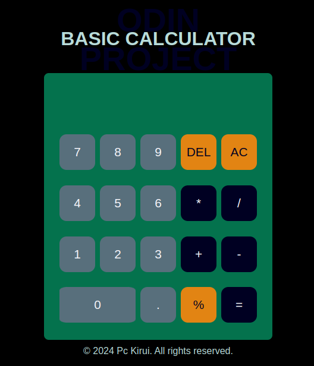

# jsCalculator

Basic JavaScript Calculator - Solution to
the calculator app challenge on Odin project.

## Overview

### Screenshot

This is how the app looked on my PC.

### Project Goals

The challenge entailed creating a calculator application containing all the basic math operations found in a calculator, e.g addition, subtraction, multiplication and division.

Check this [link](https://www.theodinproject.com/lessons/foundations-calculator) for more details on what should be done.

### Extra Credit

The task included adding floating point numbers, backspace button, keyboard support and making the app look nice.

If you have checked on the live-preview you will realize its only the keyboard support that is not working.

### Completion

I started the project in late May and have acomplished most of the project requirements. The project was not that easy, but after going through freeCode camp article by Zell Liew, discussing with my buddies and watching some youtube videos, I was able to handle it well.Will be coming back to add keyboard support, though I consider it complete.

This is the last project of the Odins foundation course. Am quite happy with the progress.

### Links

- Solution URL: [solution](https://github.com/Pc-Kirui/jsCalculator.git)
- Live preview: [preview](https://pc-kirui.github.io/jsCalculator/)

### Technologies & Tools

- HTML5 markup
- SCSS
- Javascript
- Git and GitHub

### What I Learned

The project enabled me to enhance my level of understanding on the technologies mentioned obove.

#### _Selecting elements using CSS_

This is done through the use of :

- querySeloctor() - Used to select a single element. If selcector matches many elements on the page, just one the first one is required.
- querySelectorAll() - Will select all the items that match the selector and store them in a Nodelist (an array).

### _Loops and Iterations_

Lets us accomplish repeated tasks, such as printing a number numerous times or iterating through an array. With loops we can access every item of an array. They include :

- forEach() - It loops through an array and run a function that you define for each item in the array.

- array.map - Executes a function for each item of the array and returns a new array after the callback function.

- for...of loop - Does the same thing as forEach() loop.

### _DOM Events_

They are user interactions when you are using your application. They can be clicking buttons, hovering over items on the screen, submitting forms, refreshing pages and other activities that users enjoy.

EventListener method is the reccomended way to handle events in Javascript. It allows you to define a function that will be executed whenever event you specify is triggered.
